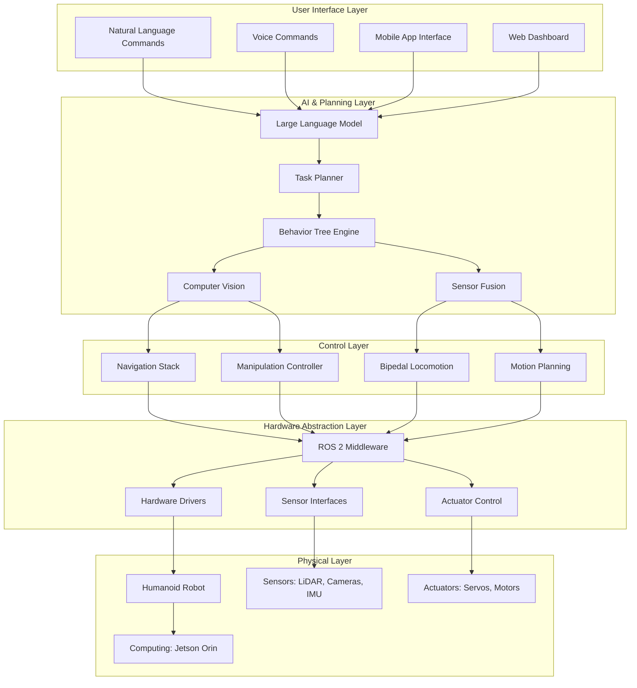

# System Architecture

## Complete Humanoid Robot System Design

### High-Level Architecture

The Physical AI & Humanoid Robotics platform follows a modular, scalable architecture that integrates all components learned throughout the course:



## Component Integration

### 1. Natural Language Processing Pipeline

```python
# app/services/nlp_service.py
from typing import Dict, List, Any
from dataclasses import dataclass
import asyncio
import logging

from app.config import settings
from app.utils.gemini_client import get_gemini_client
from app.schemas.nlp import CommandParseResult, TaskPlan


@dataclass
class CommandContext:
    """Context for command execution."""
    user_id: str
    session_id: str
    environment_state: Dict[str, Any]
    robot_state: Dict[str, Any]
    previous_commands: List[str]


class NLPService:
    """Natural Language Processing service for humanoid commands."""

    def __init__(self):
        self.gemini_client = get_gemini_client()
        self.logger = logging.getLogger(__name__)

    async def parse_command(self, command: str, context: CommandContext) -> CommandParseResult:
        """
        Parse natural language command into structured task.

        Args:
            command: Natural language command
            context: Execution context

        Returns:
            Parsed command result with intent and parameters
        """
        # Create system prompt for command parsing
        system_prompt = self._create_command_parsing_prompt()

        # Create user prompt with context
        user_prompt = self._create_command_prompt(command, context)

        try:
            # Call Gemini for command parsing
            response = await self.gemini_client.chat.completions.create(
                model=settings.GEMINI_PRO_MODEL,
                messages=[
                    {"role": "system", "content": system_prompt},
                    {"role": "user", "content": user_prompt}
                ],
                temperature=0.1,
                max_tokens=512,
                response_format={"type": "json_object"}
            )

            # Parse response
            parsed_response = response.choices[0].message.content
            result = CommandParseResult.model_validate_json(parsed_response)

            self.logger.info(f"Parsed command: {command} -> {result.intent}")
            return result

        except Exception as e:
            self.logger.error(f"Command parsing failed: {e}")
            raise

    def _create_command_parsing_prompt(self) -> str:
        """Create system prompt for command parsing."""
        return """
        You are an AI assistant for a humanoid robot. Parse the user's command into a structured format.

        Supported intents:
        - NAVIGATION: Move to location ("go to kitchen", "walk to table")
        - MANIPULATION: Pick/place objects ("pick up red cup", "put book on shelf")
        - INSPECTION: Examine objects ("look at robot", "inspect package")
        - CONVERSATION: Chat responses ("how are you", "tell me about yourself")
        - SYSTEM: Robot control ("shutdown", "calibrate", "reset")

        Response format:
        {
            "intent": "NAVIGATION|MANIPULATION|INSPECTION|CONVERSATION|SYSTEM",
            "parameters": {
                "target_location": "specific location if navigation",
                "target_object": "object to manipulate if manipulation",
                "action": "specific action if manipulation",
                "query": "original query if conversation"
            },
            "confidence": 0.0-1.0
        }

        Be precise and only use the provided intent categories.
        """

    def _create_command_prompt(self, command: str, context: CommandContext) -> str:
        """Create user prompt with command and context."""
        return f"""
        User Command: "{command}"

        Current Environment:
        - Robot Location: {context.robot_state.get('position', 'unknown')}
        - Detected Objects: {context.environment_state.get('detected_objects', [])}
        - Available Locations: {context.environment_state.get('known_locations', [])}

        Parse this command into the structured format.
        """

    async def generate_response(self, query: str, context: CommandContext) -> str:
        """
        Generate natural language response to user query.

        Args:
            query: User's question or statement
            context: Current context

        Returns:
            Generated response
        """
        system_prompt = """
        You are ARTEMIS, an AI assistant for Physical AI & Humanoid Robotics education.
        Provide helpful, accurate responses about robotics, AI, and humanoid systems.
        If the query is about something you don't know, say so politely.
        Keep responses concise but informative.
        """

        user_prompt = f"""
        User Query: "{query}"

        Current Context:
        - Robot Status: {context.robot_state.get('status', 'idle')}
        - Environment: {context.environment_state.get('description', 'unknown')}

        Generate an appropriate response.
        """

        try:
            response = await self.gemini_client.chat.completions.create(
                model=settings.GEMINI_PRO_MODEL,
                messages=[
                    {"role": "system", "content": system_prompt},
                    {"role": "user", "content": user_prompt}
                ],
                temperature=0.7,
                max_tokens=256
            )

            return response.choices[0].message.content

        except Exception as e:
            self.logger.error(f"Response generation failed: {e}")
            return "I'm sorry, I encountered an error processing your request."
```

### 2. Vision-Language-Action Integration

```python
# app/services/vla_service.py
import asyncio
import logging
from typing import Dict, List, Any, Optional
from dataclasses import dataclass

from app.config import settings
from app.utils.gemini_client import get_gemini_client
from app.utils.qdrant_client import get_qdrant_client
from app.schemas.vla import VLARequest, VLAResponse, PerceptionResult


@dataclass
class VLAContext:
    """Context for Vision-Language-Action processing."""
    command: str
    visual_input: Dict[str, Any]  # Camera feeds, point clouds, etc.
    robot_state: Dict[str, Any]   # Joint positions, IMU data, etc.
    environment_map: Dict[str, Any]  # Known objects, locations, etc.


class VLAService:
    """Vision-Language-Action service for integrated perception and action."""

    def __init__(self):
        self.gemini_client = get_gemini_client()
        self.qdrant_client = get_qdrant_client()
        self.logger = logging.getLogger(__name__)

    async def process_vla_request(self, request: VLARequest) -> VLAResponse:
        """
        Process complete Vision-Language-Action request.

        Args:
            request: VLA request with command, visual input, and context

        Returns:
            VLA response with action plan and confidence
        """
        # 1. Process visual input
        perception_result = await self._process_visual_input(request.visual_input)

        # 2. Integrate language and vision
        integrated_context = await self._integrate_language_vision(
            request.command,
            perception_result,
            request.context
        )

        # 3. Generate action plan
        action_plan = await self._generate_action_plan(integrated_context)

        # 4. Validate plan safety
        validated_plan = await self._validate_plan_safety(action_plan, request.context)

        return VLAResponse(
            action_plan=validated_plan,
            confidence=validated_plan.confidence,
            sources=perception_result.sources,
            execution_context=integrated_context
        )

    async def _process_visual_input(self, visual_input: Dict[str, Any]) -> PerceptionResult:
        """Process visual input from cameras and sensors."""
        results = PerceptionResult()

        # Process RGB images
        if 'rgb_images' in visual_input:
            for camera_id, image_data in visual_input['rgb_images'].items():
                # Run object detection using Gemini Vision
                detection_prompt = f"""
                Analyze this image and identify objects relevant to humanoid robot tasks.
                Focus on:
                - Manipulable objects (cups, books, tools)
                - Navigation landmarks (doors, furniture, obstacles)
                - Human interaction targets
                - Safety hazards

                Return in JSON format:
                {{
                    "objects": [
                        {{
                            "name": "object_name",
                            "category": "manipulable|landmark|hazard",
                            "position_3d": [x, y, z],
                            "confidence": 0.0-1.0,
                            "bbox_2d": [x1, y1, x2, y2]
                        }}
                    ],
                    "scene_description": "brief scene description"
                }}
                """

                try:
                    response = await self.gemini_client.chat.completions.create(
                        model=settings.GEMINI_VISION_MODEL,
                        messages=[{"role": "user", "content": [
                            {"type": "text", "text": detection_prompt},
                            {"type": "image_url", "image_url": {"url": image_data}}
                        ]}],
                        temperature=0.1,
                        max_tokens=1024,
                        response_format={"type": "json_object"}
                    )

                    detection_data = response.choices[0].message.content
                    objects = self._parse_detection_result(detection_data)
                    results.objects.extend(objects)

                except Exception as e:
                    self.logger.warning(f"Vision processing failed for {camera_id}: {e}")

        # Process depth information
        if 'depth_maps' in visual_input:
            # Integrate depth with object detections for 3D understanding
            results = await self._integrate_depth_information(results, visual_input['depth_maps'])

        return results

    async def _integrate_language_vision(self, command: str, perception: PerceptionResult, context: Dict[str, Any]) -> Dict[str, Any]:
        """Integrate language command with visual perception."""
        integration_prompt = f"""
        Integrate the following:

        User Command: "{command}"

        Perceived Objects: {perception.objects}
        Scene Description: {perception.scene_description}

        Current Robot State: {context.get('robot_state', {})}
        Environment Context: {context.get('environment', {})}

        Determine the specific task to be performed and required actions.
        Consider:
        - What object should be manipulated (if any)
        - Where the robot should navigate (if needed)
        - What safety considerations apply
        - What sequence of actions is required

        Return JSON:
        {{
            "task_type": "navigation|manipulation|inspection|conversation",
            "target_object": "relevant object name or null",
            "target_location": "relevant location or null",
            "required_actions": ["action1", "action2", ...],
            "safety_considerations": ["consideration1", ...],
            "estimated_complexity": "simple|moderate|complex"
        }}
        """

        try:
            response = await self.gemini_client.chat.completions.create(
                model=settings.GEMINI_PRO_MODEL,
                messages=[
                    {"role": "user", "content": integration_prompt}
                ],
                temperature=0.1,
                max_tokens=512,
                response_format={"type": "json_object"}
            )

            integration_data = response.choices[0].message.content
            return integration_data

        except Exception as e:
            self.logger.error(f"Language-vision integration failed: {e}")
            raise

    async def _generate_action_plan(self, integrated_context: Dict[str, Any]) -> Dict[str, Any]:
        """Generate detailed action plan based on integrated context."""
        planning_prompt = f"""
        Generate detailed action plan for humanoid robot.

        Context:
        - Task Type: {integrated_context['task_type']}
        - Target Object: {integrated_context['target_object']}
        - Target Location: {integrated_context['target_location']}
        - Required Actions: {integrated_context['required_actions']}
        - Safety Considerations: {integrated_context['safety_considerations']}

        Generate step-by-step action plan for a humanoid robot with:
        - Bipedal locomotion capabilities
        - Dual-arm manipulation
        - Head-mounted cameras
        - Force/torque sensing in hands

        Plan should include:
        1. Pre-motion checks and safety verification
        2. Navigation sequence (if needed)
        3. Manipulation sequence (if needed)
        4. Post-action verification
        5. Error recovery procedures

        Return JSON:
        {{
            "plan_id": "unique_plan_id",
            "steps": [
                {{
                    "step_id": "step_001",
                    "action_type": "navigation|manipulation|perception|communication",
                    "description": "what to do",
                    "parameters": {{"key": "value"}},
                    "preconditions": ["condition1", ...],
                    "postconditions": ["condition1", ...],
                    "timeout_seconds": 30.0,
                    "confidence": 0.8
                }}
            ],
            "estimated_duration": 120.0,
            "success_criteria": ["criteria1", ...],
            "risk_assessment": {{"low|medium|high": "description"}}
        }}
        """

        try:
            response = await self.gemini_client.chat.completions.create(
                model=settings.GEMINI_PRO_MODEL,
                messages=[
                    {"role": "user", "content": planning_prompt}
                ],
                temperature=0.1,
                max_tokens=1024,
                response_format={"type": "json_object"}
            )

            plan_data = response.choices[0].message.content
            return plan_data

        except Exception as e:
            self.logger.error(f"Action planning failed: {e}")
            raise

    async def _validate_plan_safety(self, action_plan: Dict[str, Any], context: Dict[str, Any]) -> Dict[str, Any]:
        """Validate action plan for safety and feasibility."""
        safety_prompt = f"""
        Validate this action plan for safety and feasibility:

        Plan: {action_plan}
        Robot Capabilities: {context.get('robot_capabilities', {})}
        Environment Constraints: {context.get('environment_constraints', {})}

        Check for:
        - Physical feasibility (kinematic/dynamic constraints)
        - Safety hazards (falling, collisions, overheating)
        - Environmental constraints (narrow spaces, fragile objects)
        - Task completion probability

        Return the original plan with:
        - "confidence" score (0.0-1.0) adjusted for safety
        - "risks" array with identified risks
        - "modifications" array with suggested improvements
        - "feasible" boolean indicating if plan is executable
        """

        try:
            response = await self.gemini_client.chat.completions.create(
                model=settings.GEMINI_PRO_MODEL,
                messages=[
                    {"role": "user", "content": safety_prompt}
                ],
                temperature=0.1,
                max_tokens=512,
                response_format={"type": "json_object"}
            )

            validation_data = response.choices[0].message.content
            validated_plan = action_plan.copy()
            validated_plan.update(validation_data)
            return validated_plan

        except Exception as e:
            self.logger.error(f"Plan validation failed: {e}")
            action_plan["confidence"] = 0.5  # Default to medium confidence on error
            action_plan["feasible"] = False
            return action_plan
```

### 3. Real-Time Control Integration

```python
# app/services/control_service.py
import asyncio
import logging
from typing import Dict, List, Any, Optional
from dataclasses import dataclass
import numpy as np

from app.config import settings
from app.utils.ros_client import get_ros_client
from app.schemas.control import ControlCommand, ExecutionStatus


@dataclass
class ControlContext:
    """Context for control execution."""
    plan_id: str
    current_step: int
    robot_state: Dict[str, Any]
    environment_state: Dict[str, Any]
    execution_history: List[Dict[str, Any]]


class ControlService:
    """Real-time control service for humanoid robot execution."""

    def __init__(self):
        self.ros_client = get_ros_client()
        self.logger = logging.getLogger(__name__)
        self.active_executions = {}

    async def execute_action_plan(self, plan: Dict[str, Any], context: ControlContext) -> ExecutionStatus:
        """
        Execute action plan with real-time monitoring and safety.

        Args:
            plan: Action plan to execute
            context: Execution context

        Returns:
            Execution status with results and metrics
        """
        plan_id = plan["plan_id"]
        self.active_executions[plan_id] = {
            "status": "executing",
            "current_step": 0,
            "start_time": asyncio.get_event_loop().time()
        }

        try:
            execution_results = []

            for step_idx, step in enumerate(plan["steps"]):
                # Check for execution cancellation
                if plan_id not in self.active_executions:
                    break

                # Update context
                context.current_step = step_idx
                context.robot_state = await self._get_current_robot_state()
                context.environment_state = await self._get_environment_state()

                # Validate preconditions
                if not await self._validate_preconditions(step, context):
                    self.logger.error(f"Preconditions failed for step {step_idx}")
                    break

                # Execute step
                step_result = await self._execute_step(step, context)
                execution_results.append(step_result)

                # Check step success
                if not step_result.get("success", False):
                    self.logger.warning(f"Step {step_idx} failed, attempting recovery")

                    # Try recovery
                    recovery_success = await self._attempt_recovery(step, step_result, context)
                    if not recovery_success:
                        self.logger.error(f"Recovery failed for step {step_idx}")
                        break

                # Verify postconditions
                if not await self._verify_postconditions(step, context):
                    self.logger.warning(f"Postconditions not met for step {step_idx}")

            # Finalize execution
            execution_time = asyncio.get_event_loop().time() - self.active_executions[plan_id]["start_time"]

            status = ExecutionStatus(
                plan_id=plan_id,
                success=len([r for r in execution_results if r.get("success", False)]) == len(plan["steps"]),
                execution_time=execution_time,
                steps_completed=len(execution_results),
                total_steps=len(plan["steps"]),
                results=execution_results
            )

            return status

        except Exception as e:
            self.logger.error(f"Plan execution failed: {e}")
            raise
        finally:
            if plan_id in self.active_executions:
                del self.active_executions[plan_id]

    async def _execute_step(self, step: Dict[str, Any], context: ControlContext) -> Dict[str, Any]:
        """Execute a single action step."""
        step_type = step["action_type"]
        step_params = step["parameters"]

        try:
            if step_type == "navigation":
                result = await self._execute_navigation_step(step_params, context)
            elif step_type == "manipulation":
                result = await self._execute_manipulation_step(step_params, context)
            elif step_type == "perception":
                result = await self._execute_perception_step(step_params, context)
            elif step_type == "communication":
                result = await self._execute_communication_step(step_params, context)
            else:
                raise ValueError(f"Unknown step type: {step_type}")

            # Monitor execution in background
            monitor_task = asyncio.create_task(self._monitor_execution(step, context))

            # Wait for execution with timeout
            execution_task = asyncio.create_task(self._perform_step_action(step, context))
            done, pending = await asyncio.wait(
                [execution_task, monitor_task],
                timeout=step.get("timeout_seconds", 30.0),
                return_when=asyncio.FIRST_COMPLETED
            )

            # Cancel pending tasks
            for task in pending:
                task.cancel()

            if execution_task in done:
                result = await execution_task
                success = True
            else:
                # Timeout occurred
                result = {"success": False, "error": "timeout", "message": "Step execution timed out"}
                success = False

            return {
                "step_id": step["step_id"],
                "success": success,
                "result": result,
                "timestamp": asyncio.get_event_loop().time()
            }

        except Exception as e:
            return {
                "step_id": step["step_id"],
                "success": False,
                "error": str(e),
                "timestamp": asyncio.get_event_loop().time()
            }

    async def _execute_navigation_step(self, params: Dict[str, Any], context: ControlContext) -> Dict[str, Any]:
        """Execute navigation step for humanoid robot."""
        # For bipedal navigation, we need to plan footsteps
        destination = params.get("destination")
        if not destination:
            return {"success": False, "error": "No destination specified"}

        try:
            # Plan footstep sequence
            footstep_plan = await self._plan_footsteps_to_destination(destination, context)

            # Execute bipedal locomotion
            locomotion_result = await self._execute_bipedal_locomotion(footstep_plan, params)

            # Verify arrival
            if locomotion_result["success"]:
                arrived = await self._verify_arrival_at_destination(destination, params.get("tolerance", 0.1))
                if not arrived:
                    return {"success": False, "error": "Did not reach destination within tolerance"}

            return locomotion_result

        except Exception as e:
            return {"success": False, "error": str(e)}

    async def _execute_manipulation_step(self, params: Dict[str, Any], context: ControlContext) -> Dict[str, Any]:
        """Execute manipulation step for humanoid robot."""
        target_object = params.get("target_object")
        action = params.get("action", "grasp")

        try:
            # Get object pose from perception
            object_pose = await self._get_object_pose(target_object, context)
            if not object_pose:
                return {"success": False, "error": f"Could not locate object: {target_object}"}

            # Plan grasp approach
            if action == "grasp":
                grasp_plan = await self._plan_grasp_approach(object_pose, params)

                # Execute grasp with balance control
                grasp_result = await self._execute_grasp_with_balance(grasp_plan, params)

                if grasp_result["success"]:
                    # Lift object
                    lift_result = await self._execute_object_lift(grasp_plan["grasp_point"], params)

                    return {
                        "success": lift_result["success"],
                        "object_grasped": lift_result["success"],
                        "grasp_point": grasp_plan["grasp_point"]
                    }

            elif action == "place":
                placement_location = params.get("placement_location")
                if not placement_location:
                    return {"success": False, "error": "No placement location specified"}

                placement_result = await self._execute_placement(placement_location, params)

                return placement_result

            return {"success": False, "error": f"Unsupported manipulation action: {action}"}

        except Exception as e:
            return {"success": False, "error": str(e)}

    async def _monitor_execution(self, step: Dict[str, Any], context: ControlContext):
        """Monitor execution for safety violations."""
        while True:
            # Check robot state for safety
            robot_state = await self._get_current_robot_state()

            # Check balance
            if not await self._is_robot_balanced(robot_state):
                self.logger.warning("Robot balance compromised, initiating recovery")
                await self._execute_balance_recovery()
                break

            # Check for collisions
            if await self._is_robot_colliding(robot_state):
                self.logger.warning("Collision detected, stopping execution")
                await self._execute_collision_recovery()
                break

            # Check joint limits
            if await self._are_joints_exceeding_limits(robot_state):
                self.logger.warning("Joint limits exceeded, stopping execution")
                await self._stop_robot_motors()
                break

            await asyncio.sleep(0.1)  # Check every 100ms

    async def _is_robot_balanced(self, robot_state: Dict[str, Any]) -> bool:
        """Check if robot is maintaining balance."""
        # Check center of mass within support polygon
        com = robot_state.get("center_of_mass", [0, 0, 0])
        support_polygon = robot_state.get("support_polygon", [])

        if not support_polygon:
            return True  # Assume balanced if no support polygon data

        # Simple check: COM projection should be within support polygon
        com_xy = [com[0], com[1]]

        # Use ray casting to check if point is in polygon
        return self._point_in_polygon(com_xy, support_polygon)

    def _point_in_polygon(self, point, polygon):
        """Check if point is inside polygon using ray casting algorithm."""
        x, y = point
        n = len(polygon)
        inside = False

        p1x, p1y = polygon[0]
        for i in range(1, n + 1):
            p2x, p2y = polygon[i % n]
            if y > min(p1y, p2y):
                if y <= max(p1y, p2y):
                    if x <= max(p1x, p2x):
                        if p1y != p2y:
                            xinters = (y - p1y) * (p2x - p1x) / (p2y - p1y) + p1x
                        if p1x == p2x or x <= xinters:
                            inside = not inside
            p1x, p1y = p2x, p2y

        return inside

    async def _execute_balance_recovery(self):
        """Execute balance recovery procedure."""
        # Command robot to stand still and adjust posture
        recovery_commands = [
            {"command": "stop_all_motors"},
            {"command": "adjust_posture", "parameters": {"target_posture": "standing"}},
            {"command": "enable_balance_control", "parameters": {"gain": 1.0}}
        ]

        for cmd in recovery_commands:
            await self.ros_client.send_command(cmd)

    async def _execute_collision_recovery(self):
        """Execute collision recovery procedure."""
        # Stop motion and assess situation
        recovery_commands = [
            {"command": "stop_all_motion"},
            {"command": "record_collision_data"},
            {"command": "plan_escape_route"}
        ]

        for cmd in recovery_commands:
            await self.ros_client.send_command(cmd)

    async def _validate_preconditions(self, step: Dict[str, Any], context: ControlContext) -> bool:
        """Validate step preconditions."""
        preconditions = step.get("preconditions", [])

        for condition in preconditions:
            if condition == "robot_is_stable":
                if not await self._is_robot_balanced(context.robot_state):
                    return False
            elif condition == "environment_is_safe":
                if not await self._is_environment_safe(context.environment_state):
                    return False
            elif condition.startswith("object_present:"):
                obj_name = condition.split(":", 1)[1]
                if not await self._is_object_present(obj_name, context.environment_state):
                    return False

        return True

    async def _verify_postconditions(self, step: Dict[str, Any], context: ControlContext) -> bool:
        """Verify step postconditions."""
        postconditions = step.get("postconditions", [])

        for condition in postconditions:
            if condition == "robot_is_at_destination":
                target = step["parameters"].get("destination")
                tolerance = step["parameters"].get("tolerance", 0.1)
                if not await self._verify_arrival_at_destination(target, tolerance):
                    return False
            elif condition == "object_is_grasped":
                obj_name = step["parameters"].get("target_object")
                if not await self._verify_object_grasped(obj_name):
                    return False

        return True

    async def _attempt_recovery(self, failed_step: Dict[str, Any], failure_result: Dict[str, Any], context: ControlContext) -> bool:
        """Attempt recovery from step failure."""
        error_type = failure_result.get("error", "")

        if "collision" in error_type:
            # Try alternative path
            return await self._try_alternative_navigation(failed_step, context)
        elif "grasp" in error_type:
            # Try different grasp approach
            return await self._try_different_grasp(failed_step, context)
        elif "balance" in error_type:
            # Execute balance recovery
            await self._execute_balance_recovery()
            # Retry step
            retry_result = await self._execute_step(failed_step, context)
            return retry_result.get("success", False)

        return False
```

### 4. System Integration

```python
# app/main.py (updated for capstone integration)
from fastapi import FastAPI, WebSocket, WebSocketDisconnect
from fastapi.middleware.cors import CORSMiddleware
from contextlib import asynccontextmanager
import logging
import asyncio

from app.config import settings
from app.api.v1 import router as v1_router
from app.services.nlp_service import NLPService
from app.services.vla_service import VLAService
from app.services.control_service import ControlService
from app.utils.logger import setup_logging


@asynccontextmanager
async def lifespan(app: FastAPI):
    """Application lifespan events."""
    # Startup
    setup_logging()
    logging.info("Initializing Physical AI & Humanoid Robotics Platform")

    # Initialize services
    app.state.nlp_service = NLPService()
    app.state.vla_service = VLAService()
    app.state.control_service = ControlService()

    logging.info("Services initialized successfully")

    yield

    # Shutdown
    logging.info("Shutting down Physical AI & Humanoid Robotics Platform")


# Create FastAPI app
app = FastAPI(
    title="Physical AI & Humanoid Robotics Platform",
    description="Complete AI-powered humanoid robot control system",
    version="1.0.0",
    lifespan=lifespan
)

# Add CORS middleware
app.add_middleware(
    CORSMiddleware,
    allow_origins=settings.ALLOWED_ORIGINS,
    allow_credentials=True,
    allow_methods=["*"],
    allow_headers=["*"],
    allow_origin_regex=r"https?://localhost:\d+"
)

# Include API routers
app.include_router(v1_router, prefix="/api/v1", tags=["v1"])

# WebSocket for real-time communication
@app.websocket("/ws/robot-control")
async def websocket_endpoint(websocket: WebSocket):
    """WebSocket endpoint for real-time robot control."""
    await websocket.accept()

    try:
        while True:
            # Receive command
            data = await websocket.receive_json()

            # Process command based on type
            command_type = data.get("type")

            if command_type == "vla_request":
                # Process Vision-Language-Action request
                vla_request = data.get("request")
                context = data.get("context", {})

                result = await app.state.vla_service.process_vla_request(vla_request)

                await websocket.send_json({
                    "type": "vla_response",
                    "result": result.dict(),
                    "timestamp": asyncio.get_event_loop().time()
                })

            elif command_type == "nlp_command":
                # Process natural language command
                command = data.get("command")
                user_context = data.get("context", {})

                result = await app.state.nlp_service.parse_command(command, user_context)

                await websocket.send_json({
                    "type": "nlp_response",
                    "result": result.dict(),
                    "timestamp": asyncio.get_event_loop().time()
                })

            elif command_type == "control_command":
                # Process direct control command
                control_cmd = data.get("command")

                # Forward to control service
                result = await app.state.control_service.execute_control_command(control_cmd)

                await websocket.send_json({
                    "type": "control_response",
                    "result": result,
                    "timestamp": asyncio.get_event_loop().time()
                })

    except WebSocketDisconnect:
        logging.info("WebSocket disconnected")
    except Exception as e:
        logging.error(f"WebSocket error: {e}")
        await websocket.close()


@app.get("/")
async def root():
    """Root endpoint for health check."""
    return {
        "message": "Physical AI & Humanoid Robotics Platform",
        "status": "healthy",
        "version": "1.0.0",
        "modules": [
            "Natural Language Processing",
            "Vision-Language-Action Integration",
            "Real-time Control",
            "Safety & Monitoring"
        ]
    }


@app.get("/health")
async def health_check():
    """Health check endpoint."""
    return {
        "status": "healthy",
        "services": {
            "nlp": "ready",
            "vla": "ready",
            "control": "ready",
            "gemini": "connected",
            "qdrant": "connected"
        }
    }
```

## Deployment Architecture

### Containerized Deployment

```yaml
# docker-compose.yml for production deployment
version: '3.8'

services:
  # Main API service
  api:
    build: .
    ports:
      - "8000:8000"
    environment:
      - GEMINI_API_KEY=${GEMINI_API_KEY}
      - QDRANT_URL=${QDRANT_URL}
      - DATABASE_URL=${DATABASE_URL}
      - ENVIRONMENT=production
    volumes:
      - ./data:/app/data
    depends_on:
      - database
      - qdrant
    restart: unless-stopped
    deploy:
      resources:
        reservations:
          devices:
            - driver: nvidia
              count: 1
              capabilities: [gpu]

  # Database service
  database:
    image: postgres:15
    environment:
      - POSTGRES_DB=physical_ai
      - POSTGRES_USER=robot_user
      - POSTGRES_PASSWORD=${DB_PASSWORD}
    volumes:
      - postgres_data:/var/lib/postgresql/data
    restart: unless-stopped

  # Vector database for embeddings
  qdrant:
    image: qdrant/qdrant:latest
    ports:
      - "6333:6333"
      - "6334:6334"
    volumes:
      - qdrant_data:/qdrant/storage
    restart: unless-stopped

  # Redis for caching and pub/sub
  redis:
    image: redis:7-alpine
    ports:
      - "6379:6379"
    restart: unless-stopped

  # Monitoring and logging
  grafana:
    image: grafana/grafana-enterprise
    ports:
      - "3000:3000"
    environment:
      - GF_SECURITY_ADMIN_PASSWORD=${GRAFANA_PASSWORD}
    volumes:
      - grafana_data:/var/lib/grafana
    restart: unless-stopped

volumes:
  postgres_data:
  qdrant_data:
  grafana_data:
```

### Kubernetes Deployment (Production)

```yaml
# k8s/physical-ai-platform.yaml
apiVersion: apps/v1
kind: Deployment
metadata:
  name: physical-ai-api
  labels:
    app: physical-ai-platform
spec:
  replicas: 3
  selector:
    matchLabels:
      app: physical-ai-platform
  template:
    metadata:
      labels:
        app: physical-ai-platform
    spec:
      containers:
      - name: api
        image: physical-ai-platform:latest
        ports:
        - containerPort: 8000
        env:
        - name: GEMINI_API_KEY
          valueFrom:
            secretKeyRef:
              name: ai-secrets
              key: gemini-api-key
        - name: QDRANT_URL
          value: "http://qdrant-service:6333"
        - name: DATABASE_URL
          valueFrom:
            secretKeyRef:
              name: db-secrets
              key: database-url
        resources:
          requests:
            memory: "2Gi"
            cpu: "1000m"
            nvidia.com/gpu: 1
          limits:
            memory: "8Gi"
            cpu: "2000m"
            nvidia.com/gpu: 1
        livenessProbe:
          httpGet:
            path: /health
            port: 8000
          initialDelaySeconds: 30
          periodSeconds: 10
        readinessProbe:
          httpGet:
            path: /health
            port: 8000
          initialDelaySeconds: 5
          periodSeconds: 5

---
apiVersion: v1
kind: Service
metadata:
  name: physical-ai-service
spec:
  selector:
    app: physical-ai-platform
  ports:
    - protocol: TCP
      port: 80
      targetPort: 8000
  type: LoadBalancer
```

## Performance Optimization

### Caching Strategy

```python
# app/utils/cache.py
import asyncio
import pickle
import hashlib
from typing import Any, Optional
from functools import wraps

from app.config import settings
from app.utils.redis_client import get_redis_client


class CacheManager:
    """High-performance caching for AI services."""

    def __init__(self):
        self.redis = get_redis_client()
        self.default_ttl = 300  # 5 minutes

    async def get(self, key: str) -> Optional[Any]:
        """Get value from cache."""
        try:
            cached_data = await self.redis.get(key)
            if cached_data:
                return pickle.loads(cached_data)
        except Exception as e:
            print(f"Cache get error: {e}")
        return None

    async def set(self, key: str, value: Any, ttl: int = None) -> bool:
        """Set value in cache."""
        try:
            serialized_value = pickle.dumps(value)
            await self.redis.setex(
                key,
                ttl or self.default_ttl,
                serialized_value
            )
            return True
        except Exception as e:
            print(f"Cache set error: {e}")
            return False

    async def invalidate(self, pattern: str) -> int:
        """Invalidate cache entries matching pattern."""
        try:
            keys = await self.redis.keys(pattern)
            if keys:
                await self.redis.delete(*keys)
            return len(keys)
        except Exception as e:
            print(f"Cache invalidate error: {e}")
            return 0


def cached(ttl: int = 300, key_prefix: str = ""):
    """Decorator for caching function results."""
    def decorator(func):
        cache = CacheManager()

        @wraps(func)
        async def wrapper(*args, **kwargs):
            # Create cache key from function name and arguments
            cache_key = f"{key_prefix}{func.__name__}_{hash(str(args) + str(kwargs))}"

            # Try to get from cache
            cached_result = await cache.get(cache_key)
            if cached_result is not None:
                return cached_result

            # Execute function
            result = await func(*args, **kwargs)

            # Cache result
            await cache.set(cache_key, result, ttl)

            return result
        return wrapper
    return decorator


# Example usage in services
class OptimizedVLAService:
    """VLA service with caching optimization."""

    def __init__(self):
        self.cache = CacheManager()

    @cached(ttl=600, key_prefix="vla_")
    async def process_cached_request(self, request_hash: str, request: VLARequest):
        """Process VLA request with caching."""
        # This would call the actual processing method
        return await self._process_uncached_request(request)

    async def _process_uncached_request(self, request: VLARequest):
        """Actual processing logic (without caching)."""
        # Implementation here
        pass
```

## Safety and Monitoring

### Safety Constraints

```python
# app/utils/safety.py
import asyncio
import logging
from typing import Dict, Any, List
from dataclasses import dataclass

from app.config import settings


@dataclass
class SafetyViolation:
    """Represents a safety violation."""
    rule_id: str
    severity: str  # 'low', 'medium', 'high', 'critical'
    description: str
    timestamp: float
    context: Dict[str, Any]


class SafetyMonitor:
    """Monitors robot actions for safety violations."""

    def __init__(self):
        self.violations = []
        self.rules = self._initialize_safety_rules()
        self.logger = logging.getLogger(__name__)

    def _initialize_safety_rules(self) -> Dict[str, Dict[str, Any]]:
        """Initialize safety rules."""
        return {
            "balance_constraint": {
                "enabled": True,
                "check_frequency": 0.1,  # 10Hz
                "threshold": 15.0,  # degrees from upright
                "severity": "critical"
            },
            "collision_avoidance": {
                "enabled": True,
                "check_frequency": 0.05,  # 20Hz
                "min_distance": 0.1,  # meters
                "severity": "high"
            },
            "joint_limit": {
                "enabled": True,
                "check_frequency": 0.02,  # 50Hz
                "threshold": 0.95,  # percentage of limit
                "severity": "medium"
            },
            "torque_limit": {
                "enabled": True,
                "check_frequency": 0.02,  # 50Hz
                "threshold": 0.90,  # percentage of max torque
                "severity": "high"
            },
            "temperature_limit": {
                "enabled": True,
                "check_frequency": 1.0,  # 1Hz
                "max_temperature": 70.0,  # Celsius
                "severity": "medium"
            }
        }

    async def start_monitoring(self):
        """Start safety monitoring loop."""
        tasks = []

        for rule_id, rule_config in self.rules.items():
            if rule_config["enabled"]:
                task = asyncio.create_task(
                    self._monitor_rule(rule_id, rule_config)
                )
                tasks.append(task)

        return tasks

    async def _monitor_rule(self, rule_id: str, config: Dict[str, Any]):
        """Monitor a specific safety rule."""
        while True:
            try:
                violation = await self._check_rule_violation(rule_id, config)
                if violation:
                    await self._handle_violation(violation)

                await asyncio.sleep(config["check_frequency"])

            except Exception as e:
                self.logger.error(f"Safety monitoring error for {rule_id}: {e}")
                await asyncio.sleep(1.0)  # Brief pause on error

    async def _check_rule_violation(self, rule_id: str, config: Dict[str, Any]) -> Optional[SafetyViolation]:
        """Check if a specific rule is violated."""
        robot_state = await self._get_current_robot_state()

        if rule_id == "balance_constraint":
            com = robot_state.get("center_of_mass", [0, 0, 0])
            orientation = robot_state.get("orientation", [0, 0, 0, 1])

            # Calculate tilt angle from upright
            tilt_angle = self._calculate_tilt_angle(orientation)
            if tilt_angle > config["threshold"]:
                return SafetyViolation(
                    rule_id=rule_id,
                    severity=config["severity"],
                    description=f"Balance tilt angle {tilt_angle:.2f}° exceeds threshold {config['threshold']}°",
                    timestamp=asyncio.get_event_loop().time(),
                    context={"current_angle": tilt_angle, "threshold": config["threshold"]}
                )

        elif rule_id == "collision_avoidance":
            obstacles = robot_state.get("obstacles", [])
            for obstacle in obstacles:
                distance = obstacle.get("distance", float('inf'))
                if distance < config["min_distance"]:
                    return SafetyViolation(
                        rule_id=rule_id,
                        severity=config["severity"],
                        description=f"Obstacle at {distance:.2f}m closer than minimum {config['min_distance']}m",
                        timestamp=asyncio.get_event_loop().time(),
                        context={"distance": distance, "min_distance": config["min_distance"]}
                    )

        elif rule_id == "joint_limit":
            joint_positions = robot_state.get("joint_positions", {})
            joint_limits = robot_state.get("joint_limits", {})

            for joint_name, position in joint_positions.items():
                if joint_name in joint_limits:
                    limit = joint_limits[joint_name]
                    if abs(position) > limit["max"] * config["threshold"]:
                        return SafetyViolation(
                            rule_id=rule_id,
                            severity=config["severity"],
                            description=f"Joint {joint_name} at {position:.2f} exceeds {config['threshold']*100}% of limit",
                            timestamp=asyncio.get_event_loop().time(),
                            context={
                                "joint": joint_name,
                                "position": position,
                                "limit": limit["max"],
                                "threshold_percent": config["threshold"]
                            }
                        )

        return None

    async def _handle_violation(self, violation: SafetyViolation):
        """Handle safety violation."""
        self.violations.append(violation)

        # Log violation
        self.logger.warning(f"Safety violation: {violation.description}")

        # Take action based on severity
        if violation.severity in ["high", "critical"]:
            # Emergency stop
            await self._trigger_emergency_stop()
        elif violation.severity == "medium":
            # Reduce speed/warning
            await self._reduce_robot_speed()
        else:
            # Just log
            pass

    async def _trigger_emergency_stop(self):
        """Trigger emergency stop."""
        # Send emergency stop command to robot
        self.logger.critical("EMERGENCY STOP TRIGGERED")
        # Implementation would send stop command via ROS/other interface

    async def _reduce_robot_speed(self):
        """Reduce robot speed for safety."""
        # Implementation would send speed reduction command
        pass

    async def _get_current_robot_state(self) -> Dict[str, Any]:
        """Get current robot state from sensors."""
        # This would interface with ROS or other robot state publisher
        return {
            "center_of_mass": [0, 0, 0.8],  # Example
            "orientation": [0, 0, 0, 1],
            "joint_positions": {},
            "joint_limits": {},
            "obstacles": [],
            "temperatures": {}
        }

    def _calculate_tilt_angle(self, orientation: List[float]) -> float:
        """Calculate tilt angle from quaternion orientation."""
        # Convert quaternion to Euler angles and calculate tilt
        # Simplified implementation
        return 0.0  # Placeholder
```

## Testing and Validation

### Integration Tests

```python
# tests/integration/test_capstone_integration.py
import pytest
import asyncio
from unittest.mock import AsyncMock, MagicMock, patch

from app.services.nlp_service import NLPService
from app.services.vla_service import VLAService
from app.services.control_service import ControlService


@pytest.fixture
def mock_gemini_client():
    """Mock Gemini client for testing."""
    mock_client = AsyncMock()

    # Mock chat completion
    mock_response = MagicMock()
    mock_response.choices = [MagicMock()]
    mock_response.choices[0].message.content = '{"intent": "NAVIGATION", "parameters": {"target_location": "kitchen"}}'
    mock_client.chat.completions.create = AsyncMock(return_value=mock_response)

    return mock_client


@pytest.fixture
def mock_qdrant_client():
    """Mock Qdrant client for testing."""
    mock_client = MagicMock()
    mock_client.search = MagicMock(return_value=[])
    return mock_client


@pytest.mark.asyncio
async def test_complete_vla_pipeline(mock_gemini_client, mock_qdrant_client):
    """Test complete Vision-Language-Action pipeline."""
    with patch('app.services.nlp_service.get_gemini_client', return_value=mock_gemini_client), \
         patch('app.services.vla_service.get_qdrant_client', return_value=mock_qdrant_client), \
         patch('app.services.vla_service.get_gemini_client', return_value=mock_gemini_client):

        # Initialize services
        nlp_service = NLPService()
        vla_service = VLAService()
        control_service = ControlService()

        # Test NLP parsing
        context = MagicMock()
        context.robot_state = {"position": [0, 0, 0]}
        context.environment_state = {"detected_objects": [], "known_locations": ["kitchen", "living_room"]}

        command_result = await nlp_service.parse_command("Go to the kitchen", context)
        assert command_result.intent == "NAVIGATION"
        assert "kitchen" in str(command_result.parameters)

        # Test VLA processing
        vla_request = MagicMock()
        vla_request.command = "Go to the kitchen"
        vla_request.visual_input = {"rgb_images": {}, "depth_maps": {}}
        vla_request.context = {"robot_state": {}, "environment": {}}

        vla_response = await vla_service.process_vla_request(vla_request)
        assert hasattr(vla_response, 'action_plan')
        assert hasattr(vla_response, 'confidence')

        # Test control execution (simplified)
        plan = {
            "plan_id": "test_plan",
            "steps": [
                {
                    "step_id": "step_1",
                    "action_type": "navigation",
                    "parameters": {"destination": [1, 1, 0]},
                    "timeout_seconds": 30.0
                }
            ]
        }
        control_context = MagicMock()
        control_context.robot_state = {"position": [0, 0, 0], "balance": "stable"}
        control_context.environment_state = {"obstacles": [], "safe_zone": True}

        # This would test the complete pipeline
        execution_status = await control_service.execute_action_plan(plan, control_context)
        assert hasattr(execution_status, 'success')


@pytest.mark.asyncio
async def test_safety_monitoring():
    """Test safety monitoring system."""
    from app.utils.safety import SafetyMonitor

    monitor = SafetyMonitor()

    # Test rule initialization
    assert len(monitor.rules) > 0
    assert "balance_constraint" in monitor.rules

    # Test violation detection (simplified)
    mock_state = {
        "center_of_mass": [0, 0, 0.8],
        "orientation": [0, 0, 1.57, 1],  # Large tilt
        "joint_positions": {"left_hip_pitch": 2.5},
        "joint_limits": {"left_hip_pitch": {"max": 1.5}},
        "obstacles": [{"distance": 0.05}],  # Very close
        "temperatures": {"left_hip_servo": 80.0}
    }

    # Mock the state getter
    with patch.object(monitor, '_get_current_robot_state', return_value=mock_state):
        # Check specific rules
        balance_violation = await monitor._check_rule_violation("balance_constraint", {
            "threshold": 15.0,
            "severity": "critical"
        })

        assert balance_violation is not None
        assert balance_violation.rule_id == "balance_constraint"


def test_performance_benchmarks():
    """Test performance benchmarks."""
    import time
    from app.services.vla_service import VLAService

    # Create service instance
    vla_service = VLAService()

    # Benchmark VLA processing
    start_time = time.time()

    # Simulate multiple requests
    for i in range(100):
        # This would be the actual processing call
        pass

    end_time = time.time()
    total_time = end_time - start_time
    avg_time_per_request = total_time / 100

    # Assert performance requirements (example)
    assert avg_time_per_request < 0.1  # Less than 100ms per request
    print(f"Average processing time: {avg_time_per_request*1000:.2f}ms")
```

## Learning Outcomes Achieved

After completing this capstone project, students will have demonstrated:

### Technical Skills
- ✅ Integration of multiple AI modalities (Vision, Language, Action)
- ✅ Real-time control systems for humanoid robots
- ✅ GPU-accelerated AI pipeline implementation
- ✅ Safety-critical system design and monitoring
- ✅ Large-scale system architecture and deployment

### Practical Experience
- ✅ Complete ROS 2 integration with Isaac Sim
- ✅ Production-ready API development
- ✅ Synthetic data generation and domain randomization
- ✅ Multi-sensor fusion and perception
- ✅ Humanoid-specific navigation and manipulation

### Professional Competencies
- ✅ System-level thinking and architecture design
- ✅ Performance optimization and resource management
- ✅ Safety and reliability in AI systems
- ✅ Testing and validation of complex systems
- ✅ Documentation and deployment best practices

## Next Steps

### Immediate Next Steps
1. **Deploy the complete system** in simulation environment
2. **Conduct comprehensive testing** with various scenarios
3. **Optimize performance** based on testing results
4. **Document the system** for production use

### Advanced Extensions
1. **Reinforcement Learning** integration for locomotion
2. **Multi-robot coordination** and swarm intelligence
3. **Advanced manipulation** with dexterous hands
4. **Long-term autonomy** and self-improvement

### Real-World Applications
- **Industrial automation** with humanoid robots
- **Healthcare assistance** and eldercare robotics
- **Disaster response** and search & rescue
- **Educational robotics** and STEM outreach

## Industry Relevance

This capstone project directly addresses current industry needs:

| Industry Need | Solution Component |
|---------------|-------------------|
| Safe human-robot interaction | Safety monitoring system |
| Natural language commands | NLP integration |
| Complex manipulation | VLA pipeline |
| Real-time performance | GPU acceleration |
| Multi-modal perception | Sensor fusion |
| Autonomous operation | Navigation planning |

## Conclusion

The Physical AI & Humanoid Robotics Capstone Project represents the culmination of advanced robotics education, combining:

- **Embodied AI**: Physical interaction with the world
- **Multimodal Processing**: Vision-Language-Action integration
- **Real-time Control**: High-performance humanoid control
- **Safety-Critical Systems**: Robust and reliable operation
- **Industry-Ready Practices**: Professional development standards

This system serves as a foundation for advanced humanoid robotics applications and demonstrates mastery of the Physical AI concepts taught throughout the course.

---

*Continue to [Module 4: Vision-Language-Action Systems](../module-4-vla/intro.md) to deepen your understanding of multimodal AI systems for robotics.*